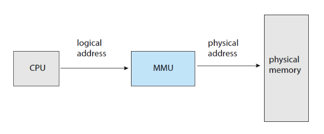
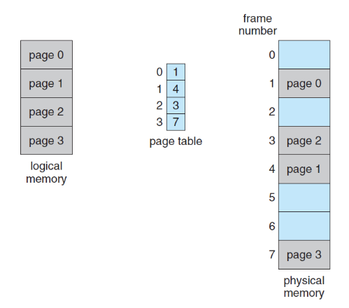

# Memory

- 프로세스는 실행중인 프로그램(실행중이란건 메인 메모리에 올라갔다는 의미)
- 각 프로세스가 자신의 메모리 공간을 사용하고 있는데, 이를 위해 base register, limit regeister가 필요.

### 주소 바인딩

- Compile time, load time, execution time(run time) binding이 있음.

### 논리적 주소, 물리적 주소

- 논리 주소 
  - 사용자 프로세스에서 사용하기 위해 CPU에서 생성된 주소
  - 실제 하드웨어 상의 주소. 메모리 주소 레지스터에 저장되는 주소
- 논리주소를 물리주소에 매핑하기 위해 논리적 주소 공간과 물리적 주소 공간 분리되어 있음.

### 메모리 관리 장치(memory management unit, MMU)

- 논리 주소를 물리 주소로 매핑하기 위한 하드웨어 장치
- MMU에는 재배치 레지스터가 존재하여 베이스 레지스터 역할. CPU가 전달한 논리 주소를 규칙에 맞춰 물리 주소에 매핑

- 재배치 레지스터에는 현재 CPU에서 수행중인 프로세스의 물리적 메모리 시작 주소가 저장

### 정적 연결

- 실행파일 만들 때 연결

### 동적 로딩

- 메모리 공간의 효율을 위해 한꺼번에 로딩하지 않고 필요할 때마다 로딩하는 방식
- 실행 이후 메모리에서 연결

### 단편화

- 외부 단편화
  - 메모리 공간이 조각조각 나눠져 있어 메모리 할당 요청을 받을 수 없는 상태(100MB 할당 가능한데, 2MB로 다 나눠져 있어서 3MB짜리도 못받음)
- 내부 단편화
  - 빈 공간에 메모리를 할당하고 난 뒤 공간이 남아 다른 메모리를 할당할 수 없는 상태(이미 할당받았는데 그 중 일부만 써도 할당 됐기 때문에 못받는거?)
- 페이징을 하면 내부 단편화, 연속 메모리 할당시 외부 단편화 발생

### 페이징

- 프로세스의 물리적 주소 공간을 불연속적으로 쪼개서 관리하는 것.
- 외부 단편화 해결 가능
- 동일한 크기로 메모리를 쪼개는 것
- 물리 메모리를 고정 크기의 블록으로 나눈 것을 프레임이라고 하며, 논리 메모리를 같은 크기로 나눈 것을 page라고 함.
- 페이지 테이블을 통해 관리

- 페이지 크기
  - 작을수록 내부 단편화 줄어들지만 페이지 테이블 크기 증가, 동일 크기 적재에 필요한 입출력횟수 증가 

- TLB를 사용하면, 캐시 메모리이기 때문에 매우 빠르게 조회 가능
  - TLB(Translation Lookaside Buffe)
    - 가상 메모리 주소를 물리적인 주소로 변화하는 속도를 높이기 위해 사용되는 캐시