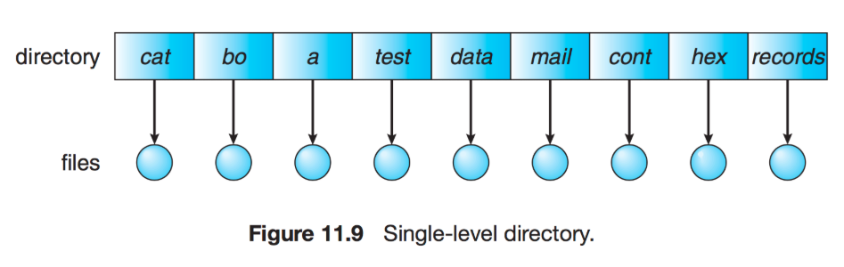
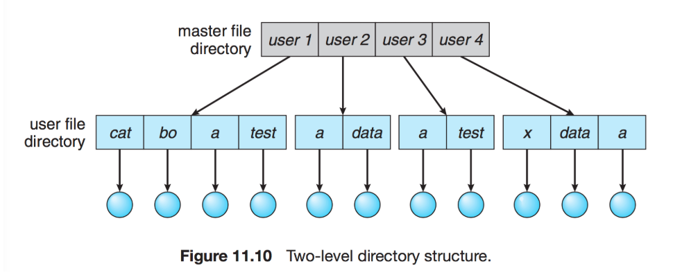
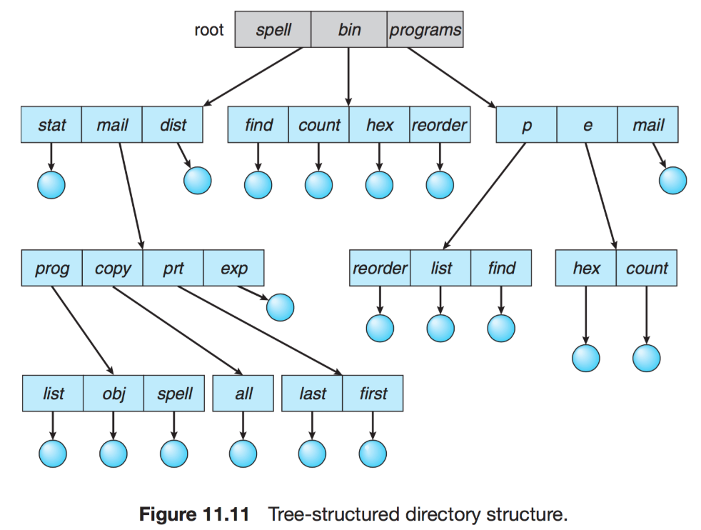
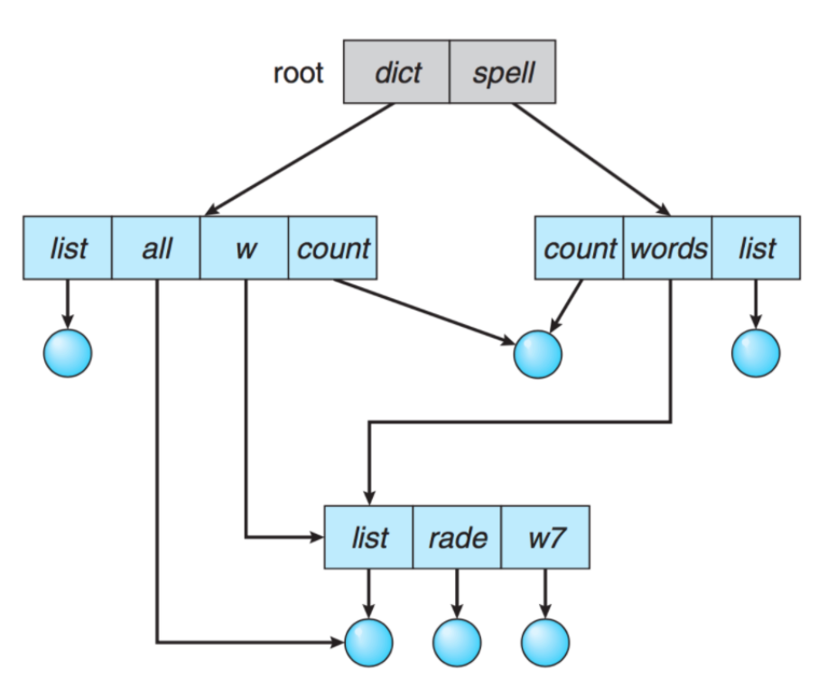

# 파일시스템

### 파일시스템

- 정의 

  - 컴퓨터에서 파일, 자료를 쉽게 찾을 수 있도록 유지, 관리하는 방법

- 특징

  - 커널 영역에서 동작
  - 파일 CRUD 기능을 원활히수행하기 위한 목적
  - 계층적 Directory 구조를 가짐

   

- 파일은 논리적인 저장 단위로, 관련된 정보 자료들의 집합에 이름을 붙인 것.
- 레코드 혹은 블록 단위로 비휘발성 보조기억장치에 저장됨.
- 구조
  - MetaData : 데이터 영역에 기록된 파일의 이름, 위치, 크기, 시간정보, 삭제유무 등의 파일 정보
  - 데이터 영역 : 파일의 데이터

### Access

- Sequential Access(순차접근)
  - 가장 단순한 접근 방법으로 파일의 정보가 레코드 순서대로 처리
- Random Access(직접 접근)
  - 파일의 레코드를 임의의 순서로 접근 가능  
- Index Access(색인 접근)
  - 레코드를 찾기 위해 색인을 찾고, 여기서 대응하는 주소에 접근

### 디렉토리 구조

- Directory는 파일의 메타데이터 중 일부를 보관하고 있는 일종의 특별한 파일
- 해당 디렉토리에 속한 ㅍ일 이름과 속성 포함
- Single Level(1단계) Directory
  - 모든 파일들이 디렉토리 밑에 존재하는 형태
  - 파일이 모두 유일한 이름을 갖고, 다른 사용자여도 동일한 파일명 사용 불가

- Two level(2단계) Directory
  - 각 사용자별로 별도의 디렉터리를 갖는 형태 
  - 서로 다른 사용자가 동일한 파일명 가능

- Tree Structured Directories
  - 사용자들이 자신의 서브 디렉토리를 만들어 파일 구성 가능
  - 각 사용자가 하나의 루트 디렉토리를 갖고, 모든 파일은 고유한 경로(절대, 상대 경로)를 갖음

- Acyclic Graph(비순환 그래프) Directory
  - 디렉토리들이 서브 디렉토리들과 파일을 공유할 수 있도록 함.(Symbolic link, NAS 등)

### 메모리사상파일

- 파일을 매번 직접 disk에서 호출하지 않고, 가상 메모리를 통해 파일을 메모리로 인식하고 사용.
- 매번 access될 때 system call이 발생되는 I/O를 메모리 참조 방식으로 대체 
- 메모리 내의 페이지들이 공유되어 여러 프로세스들이 같은 파일에 mapping(사상) 될 수 있음

### virtual memory

- 프로세스 전체가 메모리에 올라오지 않더라도 실행 가능하도록 하는 기법

- 사용자 프로그램이 물리 메모리보다 커져도 가능

  

### 요구 페이징

- 초기에 필요한 것들만 메모리에 load하는 전략

- 모든 정보가 메모리에 올라와 있지 않기 때문에, 메모리에 올라오지 않은 페이지 접근시 page fault 발생
- 이 때는 페이지 교체가 필요
  - FIFO, Optimal(최적, 앞으로 참조할 것을 알고 있는 상태), LRU(Least Recently Used, 오랫동안 사용하지 않은 것), LFU등 존재

### File System implement

### 할당

- 연속할당(Continuous Allocation)
  - 각 파일이 디스크의 연속적인 블록에 할당. 
  - 새로운 파일에 대한 공간을 찾기 힘들고, 단편화 발생
- 연결할당(Linked Allocation)
  - 각 파일이 디스크 블록의 연결 리스트를 표현(나 다음 쟤)
  - 매번 순차적 접근만 가능
- 인덱스할당(Index Allocation)
  - 모든 포인터를 인덱스 블록에서 관리.
  - 임의 접근 가능, 연속적 블록 찾지 않아도됨. 

### 복구

